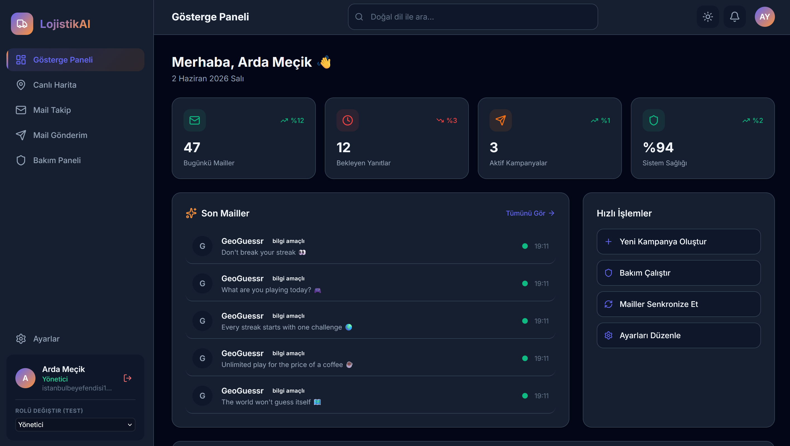
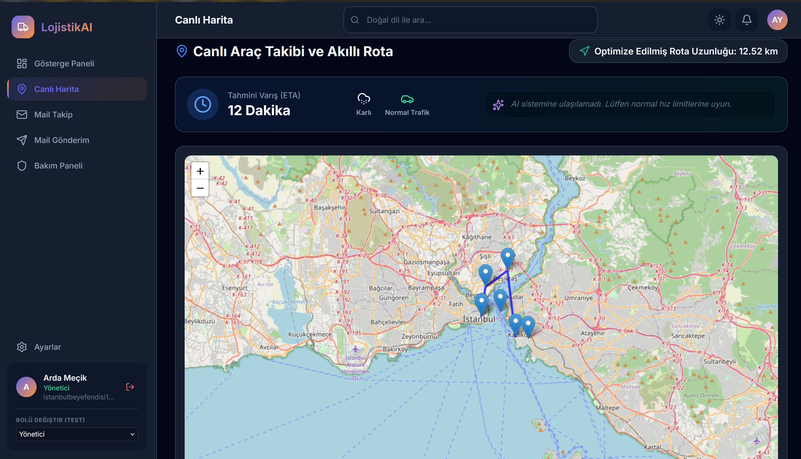
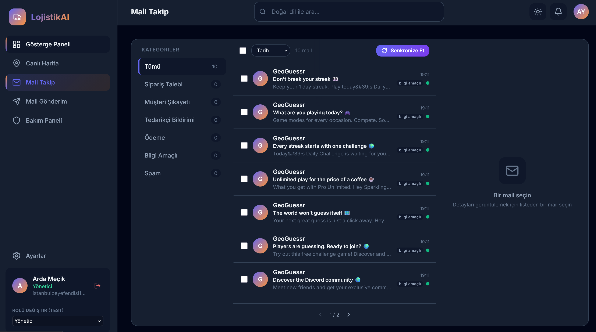
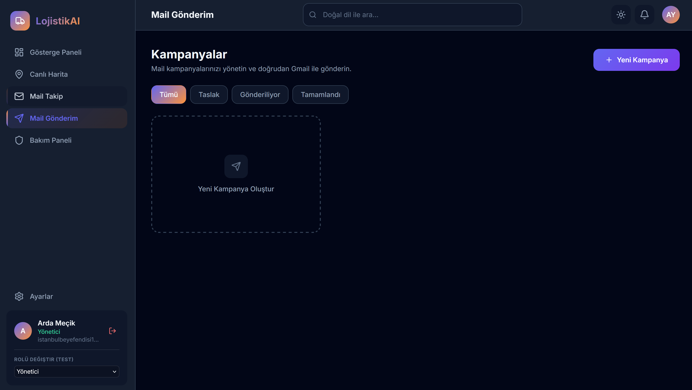
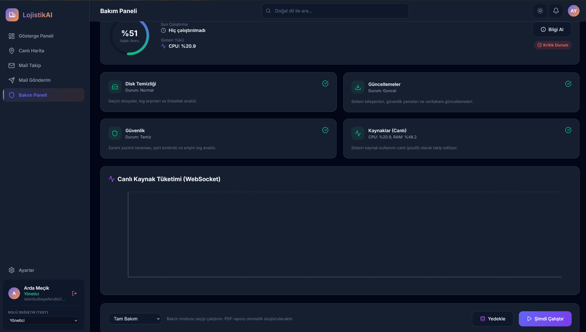

# LojistikAI - Yeni Nesil Lojistik Yönetim Sistemi

LojistikAI, modern ve ölçeklenebilir bir mimari kullanılarak geliştirilmiş, gerçek zamanlı araç takibi, gelişmiş e-posta yönetimi ve detaylı sistem sağlığı analizleri sunan kapsamlı bir lojistik yönetim platformudur.

## Özellikler

*   **Yapay Zeka (AI) Entegrasyonu ve Akıllı Rotalama:** Harita üzerinde Gemini API ve yapay zeka destekli akıllı teslimat süresi (ETA) tahminleri. Canlı hava durumu ve trafik simülasyonları ile desteklenmiş rota optimizasyonu (Leaflet).
*   **Rol Tabanlı Yetkilendirme (RBAC) ve Kullanıcı Yönetimi:** Yönetici, Sürücü ve Müşteri rolleri ile JWT tabanlı güvenli kimlik doğrulama. Her kullanıcının sadece kendi yetkisi dahilindeki sayfaları (Örn: Bakım Paneli sadece Yöneticiye) ve verileri görmesini sağlayan katı rol denetimi.
*   **Gelişmiş Sistem Bakım Paneli:** 
    *   Sistem yükünü (CPU ve RAM) WebSocket üzerinden canlı bir akış grafiği ile anlık olarak takip edin.
    *   Geçici dizinleri (%temp%, Prefetch) tek tıkla güvenle temizleyin.
    *   Port taraması ve statik kod analizi ile güvenlik zafiyetlerini anında tespit edin.
*   **Şifreli Veritabanı Yedekleme:** Tek tıkla SQLite veritabanı yedeğinizi oluşturun ve AES-128 şifreleme ile güvenli bir formata (`.enc`) dönüştürerek bilgisayarınıza indirin.
*   **Gelişmiş E-Posta Yönetimi:** Çoklu alıcı havuzları oluşturun, şablon bazlı toplu e-postalar gönderin ve açık/tıklama oranlarını detaylı kampanyalar halinde analiz edin.
*   **Tamamen Türkçe:** Kullanıcı arayüzünden backend isimlendirmelerine kadar projede Türkçe kullanılmıştır.

## Kullanılan Teknolojiler

### Frontend
*   **React 18 & Vite:** Yüksek performanslı ve hızlı derlenen arayüz altyapısı.
*   **TypeScript:** Statik tip güvenliği.
*   **Tailwind CSS:** Esnek ve hızlı modern stil yönetimi.
*   **Leaflet & React-Leaflet:** Gerçek zamanlı harita görünümü ve rota çizimi.
*   **Recharts:** Anlık websocket verilerini okuyarak çizilen animasyonlu performans grafikleri.
*   **Lucide React:** Modern ve hafif ikon seti.

### Backend
*   **FastAPI:** Modern, hızlı (yüksek performanslı) asenkron web framework.
*   **SQLAlchemy (Async):** Asenkron veritabanı ORM.
*   **SQLite:** Veritabanı yönetim sistemi (Kolay taşınabilir ve şifreli yedeklemeye uygun).
*   **WebSockets:** Canlı CPU/RAM verilerinin ve bildirimlerin istemciye anlık aktarımı.
*   **Psutil:** Sunucu sistem kaynaklarının canlı olarak okunması.
*   **ReportLab:** Bakım ve analiz sonuçlarının anında PDF olarak raporlanması.
*   **Cryptography (Fernet):** Çevresel değişkenler ve veritabanı yedekleri için güçlü simetrik (AES) şifreleme.

## Kurulum ve Çalıştırma

### Gereksinimler
*   Node.js (v18+)
*   Python (3.10+)

### Backend Kurulumu
1. Backend dizinine gidin:
   ```bash
   cd backend
   ```
2. Gerekli kütüphaneleri yükleyin:
   ```bash
   pip install -r requirements.txt
   ```
3. API sunucusunu başlatın:
   ```bash
   uvicorn uygulama.ana:uygulama --reload
   ```

### Frontend Kurulumu
1. Frontend dizinine gidin:
   ```bash
   cd frontend
   ```
2. Bağımlılıkları yükleyin:
   ```bash
   npm install
   ```
3. Geliştirme sunucusunu başlatın:
   ```bash
   npm run dev
   ```

## Güvenlik Önlemleri

Bu projede verilerin ve API yapılandırmalarının korunması için gelişmiş ve katmanlı güvenlik önlemleri uygulanmıştır:

1.  **Hassas Verilerin Gizlenmesi (`.env` Konfigürasyonu):**
    *   Tüm API anahtarları (Google Gemini, Gmail vb.), veritabanı yolları ve kritik yapılandırmalar projeye dahil edilmeyen (Git'e yüklenmeyen) gizli bir `.env` dosyasında tutulmaktadır.
    *   `git push` sırasında `.gitignore` kuralı sayesinde bu gizli dosya hiçbir zaman uzak sunucuya aktarılmaz. Bu sayede API anahtarlarınız asla GitHub'da ifşa olmaz.

2.  **Simetrik Şifreleme (AES-128 / Fernet) ve Ortam Değişkenleri:**
    *   `.env` dosyasındaki tüm anahtarlar açık metin (plain text) olarak değil, **Fernet (AES-128)** algoritmasıyla şifrelenmiş olarak saklanır.
    *   Sistem başlatıldığında `pydantic-settings` üzerinden yazılan özel `@field_validator` fonksiyonu ile bu veriler, sadece sistemin kendi hafızasında anlık olarak çözülür. Sunucunuza fiziksel erişim sağlayan yetkisiz bir kişi bile dosyalara baktığında sadece anlamsız şifreli metinler görür.

3.  **API Anahtarı ve Yapılandırma Güvenliği İçin: AES-256 (GCM Modu):**
    *   Google Gemini yapay zekasına bağlanmak için kullanılan hassas API anahtarının (API Key) dosya sisteminde (`data/config.json`) güvenli ve şifreli bir şekilde saklanması için **AES-256** şifrelemesi kullanılmaktadır. 
    *   Uygulama ilk çalıştığında otomatik bir gizli anahtar (`data/secret.key`) üretilir (bu dosya sadece sunucu sahibi tarafından erişilecek şekilde `chmod 600` ile korunur) ve bu anahtar kullanılarak API anahtarı AES algoritması ile şifrelenir. Uygulama çalışma zamanında diski yormamak adına `@lru_cache` (önbellek) kullanarak bu şifreyi bellek üzerinde çözer (decrypt) ve Gemini servisine güvenle bağlanır.

4.  **Güvenli Veritabanı Yedekleme:**
    *   Bakım paneli üzerinden veritabanı yedeği alındığında, mevcut `.db` dosyası anında Fernet anahtarı ile şifrelenir ve indirilebilir hale getirilir (`.enc` formatı). Şifreleme anahtarı bilinmeden bu yedeğin içeriği (kullanıcı bilgileri, lojistik verileri) asla çözülemez.

5.  **Statik Kod ve Port Analizi:**
    *   Yönetici panelindeki bakım modülü, aktif projede `eval()`, `exec()` gibi potansiyel zafiyet yaratabilecek fonksiyonların kullanımını periyodik olarak tarar.
    *   Aynı modül arka planda socket kullanarak açık portları (`22, 80, 443, 3306` vb.) denetler ve siber güvenlik açısından zafiyet oluşturabilecek durumları raporlar.

## Ekran Görüntüleri

Projenin arayüzüne ait ekran görüntüleri aşağıda yer almaktadır:

<p align="center">
  
</p>

<p align="center">
  
</p>

<p align="center">
  
</p>

<p align="center">
  
</p>

<p align="center">
  
</p>

## Lisans
Bu proje [MIT Lisansı](LICENSE) altında lisanslanmıştır. Daha fazla bilgi için `LICENSE` dosyasına bakabilirsiniz.
